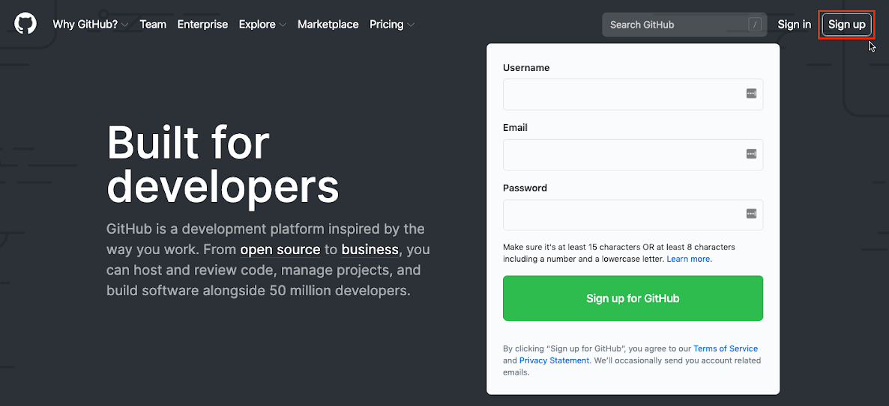
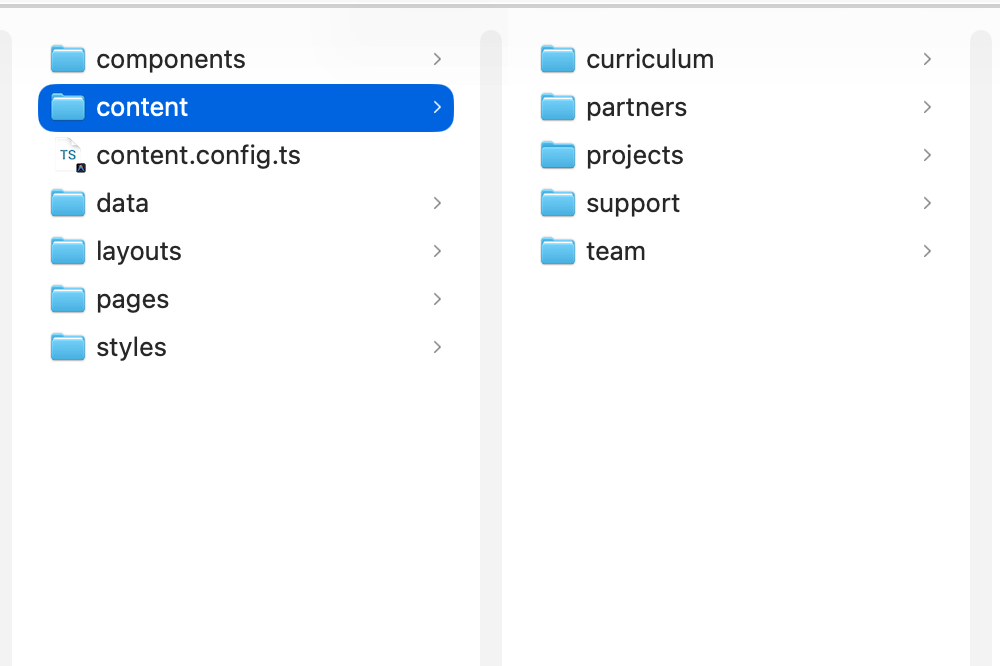
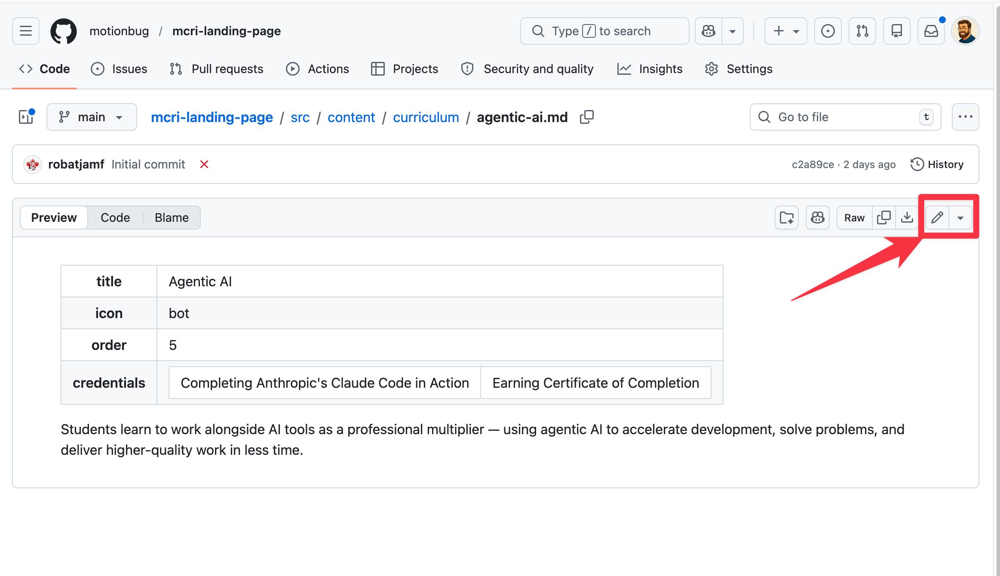
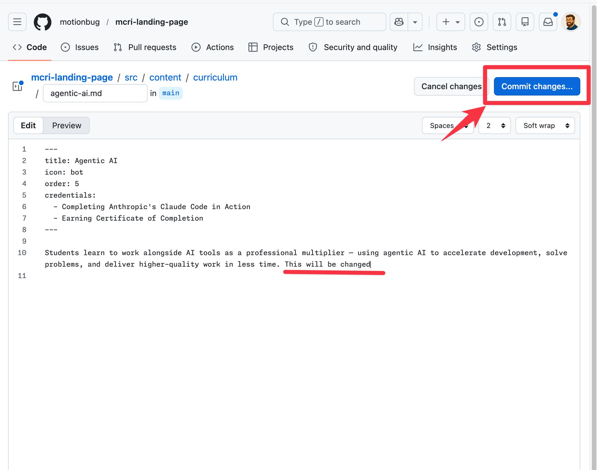
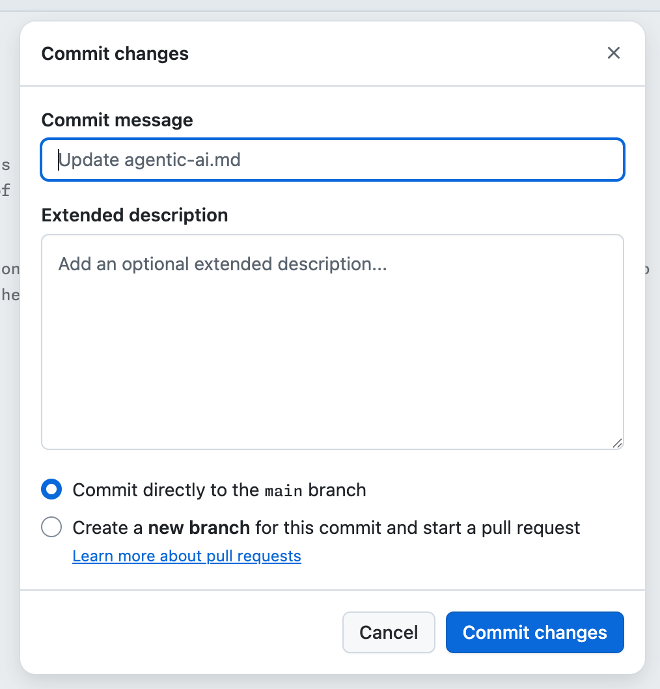

# MCRI Website — Content Editing Guide

This guide is written for someone who has never used GitHub or edited a website before. You don't need to install anything on your computer. Everything can be done in a web browser.

---

## Part 1 — Sign up for GitHub

GitHub is the service that stores the website files and automatically publishes changes to the live site whenever you save them.

1. Open your browser and go to **https://github.com**
2. Click the **Sign up** button in the top-right corner
3. Enter your **email address**, choose a **password**, and pick a **username**
   - The username can be anything — it won't appear on the website
4. Complete the verification puzzle and click **Create account**
5. GitHub will send a confirmation code to your email — enter it to finish



Once your account is created, let Rob know your GitHub username so he can invite you to the repository (the folder where all the website files live).

---

## Part 2 — Accept the invitation

After Rob adds you, you will receive an email from GitHub with the subject **"You've been invited to collaborate"**.

1. Open that email and click the **View invitation** button
2. On the page that opens, click **Accept invitation**
3. You now have access to edit the files

> 📸 *Screenshot suggestion: Invitation acceptance page*

---

## Part 3 — Find the file you want to edit

The website content lives at:
**https://github.com/motionbug/mcri-landing-page**

1. Go to that address in your browser
2. Click on the **`src`** folder
3. Click on the **`content`** folder

Inside `content` you will see four folders. Here is what each one controls:

| Folder | What it changes on the website |
|---|---|
| `curriculum/` | The course cards on the Curriculum page (Swift, Jamf, Apple, etc.) |
| `team/` | The team member cards on the About page |
| `support/` | The three support/donation cards on the Support page |
| `partners/` | The partner logos displayed in the logo bar |

4. Click the folder for the section you want to update
5. Click the file you want to edit — for example, **`dave-saltmarsh.md`**



---

## Part 4 — Edit the file

Once you have a file open, you will see its contents displayed on screen.

1. Look at the top-right corner of the file content area — you will see a small row of icons
2. Click the **pencil icon** (✏️) — it is the second-to-last icon in that row, just before the dropdown arrow
3. The file will open in an editor inside your browser



### Understanding the file format

Every file has two sections separated by a pair of `---` lines at the top and bottom. This top section is called the **front matter** — think of it as a form with labelled fields.

Here is an example from a team member file:

```
---
name: David J. Saltmarsh
title: Senior Director, Community Education Initiatives, Jamf
photo: /images/team/dave-saltmarsh.jpg
linkedin: https://www.linkedin.com/in/davidsaltmarsh/
order: 3
---

Dave founded and leads Jamf's Community Education Initiatives...
```

- Everything between the `---` lines is a **field** — a label, then a colon, then the value
- Everything **below** the second `---` is the main body text that appears as a paragraph on the page

### Rules to follow when editing

- **Do not delete or change the field labels** (the words before the colon, like `name:` or `title:`)
- **Do not remove the `---` lines**
- **Do not change** fields like `photo:`, `logo:`, `order:`, or `ctaHref:` unless you are confident — these control images and links
- You can freely edit the **value** after the colon — for example, change the text after `title:` or update the paragraph below the `---`
- Keep text on a single line unless it was already on multiple lines

---

## Part 5 — What you can safely change

### Team members (`team/` folder)

| Field | What it does | Safe to edit? |
|---|---|---|
| `name:` | The person's full name | ✅ Yes |
| `title:` | Their job title | ✅ Yes |
| `photo:` | Path to their photo | ⚠️ Only if a new photo has been added |
| `linkedin:` | Their LinkedIn profile URL | ✅ Yes |
| `order:` | Which order they appear in (1 = first) | ✅ Yes |
| Body text | The bio paragraph | ✅ Yes |

**Example — changing a job title:**

Before:
```
title: Senior Director, Community Education Initiatives, Jamf
```
After:
```
title: Vice President, Community Education Initiatives, Jamf
```

---

### Curriculum cards (`curriculum/` folder)

| Field | What it does | Safe to edit? |
|---|---|---|
| `title:` | The course name | ✅ Yes |
| `icon:` | The small icon shown on the card | ⚠️ Do not change |
| `order:` | Which order the card appears | ✅ Yes |
| `credentials:` | The list of credentials/certifications | ✅ Yes (see note below) |
| Body text | The description paragraph | ✅ Yes |

**Editing a credentials list** — each item in the list starts with two spaces and a dash:

```
credentials:
  - Learn to Code 1, 2, and 3
  - Swift Explorations, Fundamentals, and Data Collections
  - App Development with Swift — Associate & Certified User
```

To add a new item, add a new line with exactly two spaces, a dash, a space, then the text:
```
  - My new credential
```

To remove an item, delete that entire line.

---

### Support cards (`support/` folder)

| Field | What it does | Safe to edit? |
|---|---|---|
| `title:` | The card heading | ✅ Yes |
| `imageAlt:` | Description of the image (for accessibility) | ✅ Yes |
| `ctaLabel:` | The button text | ✅ Yes |
| `image:`, `ctaHref:`, `anchorId:`, `order:` | Layout/linking fields | ⚠️ Do not change |
| Body text | The description paragraphs | ✅ Yes |

---

### Partners (`partners/` folder)

| Field | What it does | Safe to edit? |
|---|---|---|
| `name:` | The organisation name | ✅ Yes |
| `href:` | The website URL it links to | ✅ Yes |
| `employedCount:` | Number of graduates employed | ✅ Yes |
| `logo:`, `logoWhite:` | Logo image paths | ⚠️ Only if a new logo has been added |
| `order:` | Display order | ✅ Yes |

---

## Part 6 — Save your changes

When you are done editing:

1. Click the blue **Commit changes...** button in the top-right corner of the editor



1. A dialog box will appear asking for a **Commit message** — replace the default text with a short description of what you changed, for example:
   - `Update Dave's job title`
   - `Fix typo in Swift curriculum description`
1. Leave the option set to **"Commit directly to the main branch"**
1. Click the blue **Commit changes** button at the bottom of the dialog



The website will automatically rebuild and publish your changes. This takes about **2 minutes**. After that, refresh the live site at **https://motionbug.github.io/mcri-landing-page/** to see your update.

---

## Part 7 — Tips and things to avoid

- **If something looks wrong after saving**, don't panic. Every change is saved in history and can be undone — just let Rob know
- **Don't use "smart quotes"** (`"` `"`) — always use straight quotes (`"`) if you need them
- **Avoid pasting text directly from Microsoft Word** — it can carry hidden characters. Use a plain text paste (Ctrl+Shift+V on Windows, or paste into Notepad first, then copy again)
- **The `order:` number** controls where something appears. `1` = first, `2` = second, and so on. Two items should not share the same number
- **Don't add new files** — adding a new team member or curriculum card requires a new file, which is a slightly different process. Ask Rob to create the file first, then you can fill in the content

---

## Quick reference — File locations

| What you want to change | File to edit |
|---|---|
| Dave Saltmarsh's bio or title | `src/content/team/dave-saltmarsh.md` |
| Kelly Watkins-Conrad's bio | `src/content/team/kelly-watkins-conrad.md` |
| Valeria Tschida's bio | `src/content/team/valeria-tschida.md` |
| Swift Development course card | `src/content/curriculum/swift.md` |
| Jamf course card | `src/content/curriculum/jamf.md` |
| Apple course card | `src/content/curriculum/apple.md` |
| macOS course card | `src/content/curriculum/macos.md` |
| Agentic AI course card | `src/content/curriculum/agentic-ai.md` |
| Essential Skills course card | `src/content/curriculum/essential-skills.md` |
| "Become an Employer Partner" card | `src/content/support/employer-partner.md` |
| "Donate Money" card | `src/content/support/donate-money.md` |
| "Donate Items" card | `src/content/support/donate-items.md` |
| Jamf partner entry | `src/content/partners/jamf.md` |
| MATTER NGO partner entry | `src/content/partners/matter-ngo.md` |
| Tradition Bank partner entry | `src/content/partners/tradition-bank.md` |
| MainSL partner entry | `src/content/partners/mainsl.md` |

---

*Guide version: April 2026. For questions, contact Rob.*
